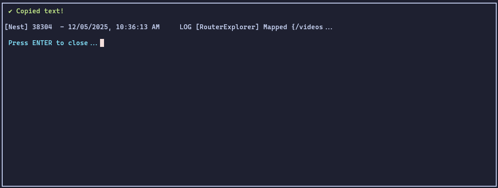
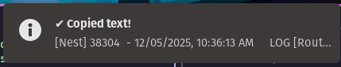

# tmux-copy-plugin

A smart `tmux` copy handler that automatically sends copied text to your system clipboard and displays a clean popup preview.

This plugin was created to address a common issue: when `tmux` is used within Neovim's integrated terminal, its copy-mode often fails to send selected text to the system clipboard. This tool provides a reliable solution, ensuring text copied in `tmux` is always available in your system's clipboard.

## Features

- **Automatic Clipboard Integration**: Seamlessly sends selected `tmux` text to your system clipboard (using `xclip`, `wl-copy`, `xsel`, `clip`, `pbcopy`).
- **Intelligent Copy Detection**: Only triggers after exiting `copy-mode`, preventing unwanted copies during selection.
- **Customizable Notifications**: Choose between `tmux` popup, `tmux` message, or system desktop notifications.

## Installation

Install directly using `go install`:

```bash
go install github.com/Marlliton/tmux-copy-plugin@v1.0.4
```

This command will download, build, and install the `tmux-copy-plugin` executable to your `$GOPATH/bin`.

## Usage

Add the following configuration to your `~/.tmux.conf` file:

```tmux
##### COPY MODE #####
bind y copy-mode
set -g mouse on
set-window-option -g mode-keys vi
# Copy with mouse automatically
bind -T copy-mode-vi MouseDragEnd1Pane send -X copy-selection-and-cancel
bind -T copy-mode MouseDragEnd1Pane send -X copy-selection-and-cancel
set-hook -g pane-mode-changed 'run-shell "tmux-copy-plugin run -n msg"'
```

**Note:** Replace `msg` with your preferred notification style (`preview`, `msg`, `system`, or `none`).

## Notification Styles

### Preview Mode (`-n preview`)

Displays a `tmux` popup with a preview of the copied text.



### Message Mode (`-n msg`)

Displays a `tmux` message in the status line.


### System Mode (`-n system`)

Sends a native desktop notification.



### None Mode (`-n none`)

No notification is displayed.

## Contributing

Contributions are welcome! Please open an issue or submit a pull request.

## License

This project is licensed under the GNU License - see the [LICENSE](LICENSE) file for details.

